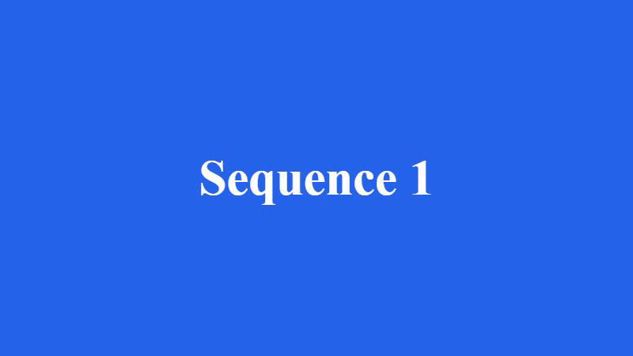
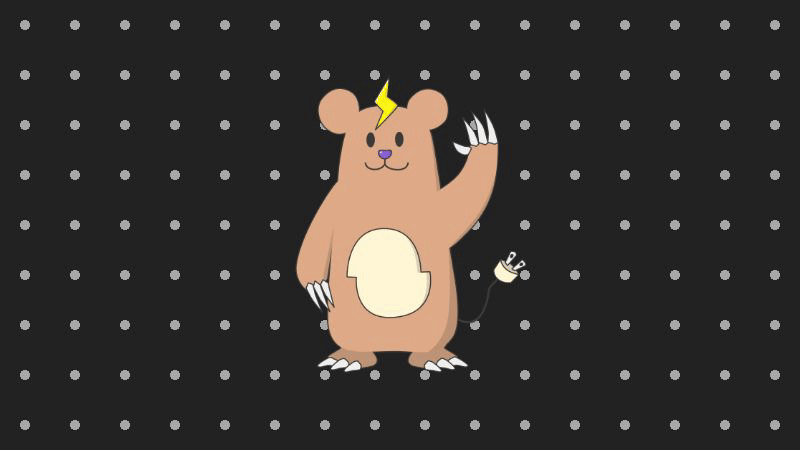
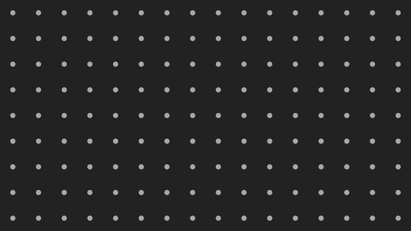

<a href="/README.ja.md">日本語版ドキュメントはこちら</a>

# Remotion Basic Sample

A collection of simple samples built with [Remotion](https://www.remotion.dev/).  
Three samples are included, so please take a look if this is your first time trying it out.

**Requirements**

| Item    | Version                 |
| ------- | ----------------------- |
| Node.js | 22.12 or later          |
| npm     | 10 or later             |
| OS      | Windows / macOS / Linux |

## Setup and Launch

Install the packages with `npm install`, then start the app with `npm run dev`.  
If needed, add the skills for Agents with `npx remotion skills add`.

```
# install packages.
> npm install

# add agent skills.
> npx remotion skills add
```

```
# launch app.
> npm run dev
```

## Samples

Each sample lives in its own file under `src/compositions/` and is registered as a `<Composition>` from `src/Root.tsx`.  
All of them are 1280x720 / 30fps.

| Sample                                                                              | Description                                                                                                                                                                                                                                                                  | Preview                                                           |
| ----------------------------------------------------------------------------------- | ---------------------------------------------------------------------------------------------------------------------------------------------------------------------------------------------------------------------------------------------------------------------------- | ----------------------------------------------------------------- |
| **Sample01**<br>[Sample01Composition.tsx](src/compositions/Sample01Composition.tsx) | **Sequence switching and transitions**<br>The first half simply switches scenes by laying out `<Sequence>` elements with `from` / `durationInFrames`.<br>The second half uses `<TransitionSeries>` to connect scenes with slide and fade transitions.                        |  |
| **Sample02**<br>[Sample02Composition.tsx](src/compositions/Sample02Composition.tsx) | **Image display and looping animation**<br>Displays images from `public/` with `` + `staticFile()`.<br>The main character keeps swaying (Wiggle) and bounces at a fixed interval (Bounce). The background scrolls a polka-dot tile diagonally.                          |  |
| **Sample03**<br>[Sample03Composition.tsx](src/compositions/Sample03Composition.tsx) | **Advanced animation (an exchange between characters)**<br>A three-Sequence structure combining `interpolate()` / `spring()` / `Easing`.<br>It includes a slide-in, a springy zoom-in, a caption display, a white flash and screen shake on impact, and a blown-away effect. |  |

## Structure

```
remotion-basic-sample/
├─ docs/
│  └─ readme/                       # GIFs used in the README
├─ public/
│  └─ images/                       # Images referenced by staticFile()
├─ src/
│  ├─ Root.tsx                      # Composition registration (list of videos)
│  ├─ index.ts                      # Remotion entry point
│  ├─ compositions/                 # The videos themselves, one per sample
│  │  ├─ Sample01Composition.tsx
│  │  ├─ Sample02Composition.tsx
│  │  └─ Sample03Composition.tsx
│  ├─ components/                   # Display parts responsible only for the look
│  │  ├─ SimpleBackground.tsx       # Background color + centered text
│  │  └─ TileScrollBackground.tsx   # Diagonally scrolling polka-dot tile background
│  └─ effects/                      # Motion calculations and wrappers
│     ├─ BounceEffect.ts            # Bouncing transform generation
│     └─ WiggleEffect.tsx           # Wiggle wrapper
└─ remotion.config.ts               # Rendering settings (applied only when running the CLI)
```

### Separation of Responsibilities

- **compositions**: Calculate parameters from the frame and assemble the whole scene. This is where the "direction" of each sample is written.
- **components**: Only render the look received via props. They hold no frame-dependent animation logic.
- **effects**: Extract motion calculations such as "sway" and "bounce" into reusable pieces. The math is kept inside the file for each effect, and visual parameters are specified by the caller.
